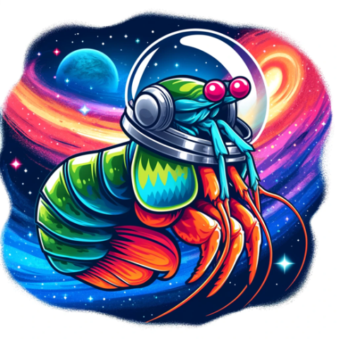

# Mantis Shrimp
<p align="center">
    
</p>

Mantis Shrimp is a computer vision model for photometric redshift estimation in the Northern sky (DEC > -30). This repository houses the model weights, a pip installable package to enable integration with existing projects, a Docker build script to run a local webapp server, jupyter notebooks demonstrating the training of Mantis Shrimp for reproducibility, tutorials in deep learning for astronomy (coming soon), and associated artifacts.  

## Installation Options


#### Package Only
To install the Mantis Shrimp package (without dependencies)

```bash
git clone https://github.com/pnnl/MantisShrimp.git
cd mantisshrimp
pip install .
```

#### Full Development Environment
To install all neccessary dependecies for reproducibility of our experiments, we include an environment.yml file that provides our exact virtual environemt and can be installed with conda. **One then needs to install the [FFCV](https://github.com/libffcv/ffcv) package seperately to run our training scripts.**
```bash
git clone https://github.com/pnnl/MantisShrimp.git
cd mantisshrimp
conda env create --name $MY_ENV --file environment.yaml
conda activate $MY_ENV
pip install .
```

#### Webapp/Production Environment
We also include a more relaxed and CPU only version of the dependencies, which likely makes running our pipeline and integration with other tools easier.

```bash
git clone https://github.com/pnnl/MantisShrimp.git
cd mantisshrimp/webapp
conda env create --name $MY_ENV --file production.yaml
conda activate $MY_ENV
cd ..
pip install .
```

## Pipeline Tutorial
Mantis Shrimp is a computer vision model, so using it on new data requires querying external servers for image cutouts. **WARNING: querying external services requires an Internet connection and can be a point of failure.** 

We include minimal pipeline command that allows the user simply provide astrometric coordinates and will return the photometric redshift.

```python

from mantis_shrimp import pipeline
from mantis_shrimp import models

DEVICE = 'cpu' #pytorch device string; could set to 'cuda'
RA = 120.00 #decimal degress
DEC = 60.00 #decimal degrees
USER_INDEX = 0 #arbitrary index used in metdata
SAVEPATH = '/tmp/mantisshrimp/' #create a storage solution for downloaded cutout fits

#attempt to create the path if it doesn't exist already
if not(os.path.exists(SAVEPATH)):
    os.path.makedirs(SAVEPATH)

model, class_bins = models.trained_early(DEVICE)

data = pipeline.get_data(USER_INDEX, RA, DEC, SAVEPATH)

photo_z, PDF, __ = pipeline.evaluate(USER_INDEX,
                                    RA,
                                    DEC,
                                    model=model,
                                    data=data, 
                                    SAVEPATH=SAVEPATH,
                                    device=DEVICE)

# This is the expectation value of the PDF which serves as our point estimate
print(photo_z)

# Or you can use the PDF to extract your own photo_z:
# For now let's visualize the PDF.
plt.title('PDF of PhotoZ for RA={:.3f} DEC={:.3f}'.format(RA,DEC))
plt.plot(class_bins,PDF)
plt.show()
```

## Running the Flask webapp using containers
To run the webapp, we include a Dockerfile:
```bash
docker build . -t mantisshrimp
docker run -p 5000:5000 mantisshrimp
```
This will launch a flask webapp server accessible from any webrowser by navigating to localhost:5000. The webapp has a simple interface that allows you to enter any astrometry one-at-a-time and returns a visualization of the PDF of redshift as well as the cutouts from PanSTARRs, WISE, and GALEX at those coordinates.

## Querying the webapp via API
Once the Webapp is running locally, you can actually ignore installing Mantis Shrimp and simply query an API at the WebApp address. PNNL will host a WebApp that you could query against; however, that app will be temporary (ends in September 2025). Users who want stability should consider deploying the server locally to query against a static address or perform the full installation.

To perform a query of the WebApp you can use the Python requests library
```python
import requests
 
# URL of the Mantis Shrimp API (adjust if necessary)
url = 'localhost:5000/predict'
 
# Prepare the data payload as a dictionary
data = {"NAME": 0, "RA":197.6144, "DEC": 18.4381}  # Example: sending data to our API
 
# Send the POST request
response = requests.post(url, json=data)
 
# Check if the request was successful
if response.status_code == 200:
    print("Success!")
    print("Response data:", response.json())  # Print the response data from the server
else:
    print("Failed to retrieve data")
    print("Status code:", response.status_code)
    print("Response text:", response.text)  # Display response text which might contain the error
```

## Limitations

This repository should be used with special context that the computer vision model was trained over a tailored dataset of spectroscopically confirmed galaxies with cutouts centered on those galaxies. Our pipeline will assign a photometric redshift to arbitrary coordinates of the sky. **However, that does not mean our model should be trusted everywhere--** galaxies that are not observed in the PanSTARRS/WISE footprint are simply not going to have accurate photometric redshifts with this tool. Additional care must be taken to ensure the target galaxy is centered on the image, which is why we advise using our tool in tandem with sky browsers, for example, available from [PanSTARRs](https://ps1images.stsci.edu/cgi-bin/ps1cutouts).

Additionally, its not likely our model extends well to galaxies outside the support of our spectroscopic training datasets, which are biased to large red elliptical galaxies. This is a problem shared for essentially all machine learning photometric redshift models unless we limit ourselves to flux-limited samples like the SDSS MGS, or soon the DESI BGS. Future work should endeavor to either mitigate this by utilizing simulated images to augment the training set or use anomaly detection to flag when cutouts are unlike anything in the training distribution. Both would be at the cutting edge of AI research. 

## Data availability

You can download the Mantis Shrimp Dataset from [PNNL's Datahub](https://data.pnnl.gov/group/nodes/dataset/33966). DataHub is a free to use data repository for PNNL; its backend is Globus. 

## External Dependencies & Considerations
In addition to the software dependencies, this software relies upon the availability of data from NASA STSci and NSF AstroDataLab servers. 

We have packaged this webapp with dustmaps provided by Yi-Kuan Chiang, author of the corrected SFD map, and the Planck map provided by the European Space Agency. The exact sources of this data are:
```bash
#STSci and ADL:
https://ps1images.stsci.edu/cgi-bin/fitscut.cgi
www.legacysurvey.org/viewer/fits-cutout?
#Dustmaps
https://zenodo.org/record/8207175/files/csfd_ebv.fits
https://zenodo.org/record/8207175/files/mask.fits
http://pla.esac.esa.int/pla/aio/product-action?MAP.MAP_ID=HFI_CompMap_ThermalDustModel_2048_R1.20.fits
```

## Citation
If you find our paper helpful or use the Mantis Shrimp model or webapp in your research, consider citing our paper:
```bash
@ARTICLE{mantisshrimpengel,
      title={Mantis Shrimp: Exploring Photometric Band Utilization in Computer Vision Networks for Photometric Redshift Estimation}, 
      author={Andrew Engel and Nell Byler and Adam Tsou and Gautham Narayan and Emmanuel Bonilla and Ian Smith},
      year={2025},
      eprint={2501.09112},
      archivePrefix={arXiv},
      primaryClass={astro-ph.IM},
      url={https://arxiv.org/abs/2501.09112}, 
}
```

## Authors

Andrew Engel (OSU and PNNL), Nell Byler (PNNL), Adam Tsou (JHU), Gautham Narayan (UIUC), Manny Bonilla (PNNL), and Ian Smith (PNNL) all contributed to this work.

## Funding Acknowledgement

A. Engel, N. Byler, A. Tsou, E. Bonilla, and Ian Smith were partially supported by an interagency agreement (IAA) between NASA and the DOE in liu of grant awarded through the NASA ROSES D.2 Astrophysics Data Analysis grant # 80NSSC23K0474, ``Multi-Survey Photometric Redshifts with Probabilistic Output for Galaxies with 0.0 < Z < 0.6.''

## Disclaimer
 
This material was prepared as an account of work sponsored by an agency of the
United States Government.  Neither the United States Government nor the United
States Department of Energy, nor Battelle, nor any of their employees, nor any
jurisdiction or organization that has cooperated in the development of these
materials, makes any warranty, express or implied, or assumes any legal
liability or responsibility for the accuracy, completeness, or usefulness or
any information, apparatus, product, software, or process disclosed, or
represents that its use would not infringe privately owned rights.

Reference herein to any specific commercial product, process, or service by
trade name, trademark, manufacturer, or otherwise does not necessarily
constitute or imply its endorsement, recommendation, or favoring by the United
States Government or any agency thereof, or Battelle Memorial Institute. The
views and opinions of authors expressed herein do not necessarily state or
reflect those of the United States Government or any agency thereof.

                 PACIFIC NORTHWEST NATIONAL LABORATORY
                              operated by
                                BATTELLE
                                for the
                   UNITED STATES DEPARTMENT OF ENERGY
                    under Contract DE-AC05-76RL01830
